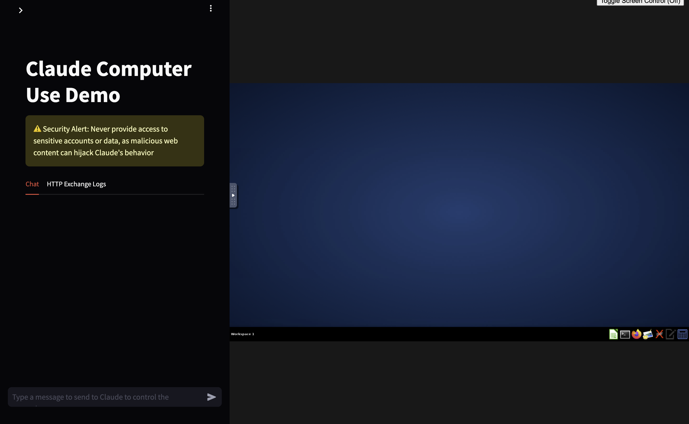

# Anthropic Computer Use Demo Complete Code

This repository contains the complete code behind the **Anthropic Computer Use Demo**, an AI-driven agent that can control your computer through simulated mouse and keyboard inputs. The project was reverse-engineered to allow users to explore and interact with an AI agent for computer control. Below are the details on the demo setup, key files, API options, and tool actions.

## Demo Overview

The demo operates within a virtual machine and is orchestrated by a shell script, `entrypoint.sh`, which initializes all necessary components and scripts. This includes setting up the virtual machine environment, launching services, and starting the frontend UI using Streamlit.

### Entrypoint and Setup Scripts

1. **entrypoint.sh** - Main script to start the virtual machine and services.
2. **Supporting Scripts:**
   - `xvfb_startup.sh` - Starts the X Virtual Framebuffer (Xvfb).
   - `x11vnc_startup.sh` - Starts the VNC server for remote control.
   - `tint2_startup.sh` - Launches the tint2 panel.
   - `novnc_startup.sh` - Sets up the noVNC service for browser-based VNC access.
   - `mutter_startup` - Initializes the Mutter window manager.
   - `http_server.py` - Runs an HTTP server for the demo.

### Frontend and Main Loop

- The frontend UI is launched with Streamlit by running `Computer_use_demo >> streamlit.py`.
- When a user submits a command in the Streamlit interface, the agent’s main loop in `loop.py` is triggered.
- **loop.py** - Core of the AI agent's functionality, where user inputs are processed and converted into actions.

## Tools and Dependencies

The virtual machine uses the following tools to support the demo:

- **vnc** - Enables remote control of the VM.
- **mutter** - Window manager to control UI elements.
- **xvfb** - X11 server for off-screen rendering.
- **tint2** - Panel used as a desktop environment.
- **noVNC** - Provides a browser-based VNC client.
- **HTTPServerV6** - Custom HTTP server for managing requests.

## Supported API Providers

This demo supports integration with three major AI API providers:

1. **Anthropic**
2. **Google Vertex**
3. **AWS Bedrock**

The demo validates the chosen provider and adapts its processing to the API in use.

## Available Tools

The AI agent has access to several tools that enable it to interact with the virtual machine environment:

### Computer Tool (computer_20241022)

- Uses **xdotool** to simulate keyboard and mouse interactions, including moving and resizing windows.
- Supports the following actions:
  - `mouse_move`, `left_click`, `right_click`, `double_click`, `middle_click`, `screenshot`, `cursor_position`, `key`, and `type`.

### Bash Tool (bash_20241022)

- Allows the agent to execute bash commands within the VM.
- Tool parameters are predefined by Anthropic and not modifiable by users.
- Details of this tool are found in `computer_use_demo/tools/bash`.

### Edit Tool (text_editor_20241022)

- A filesystem editor enabling file viewing, creation, and editing.
- Tool parameters are predefined by Anthropic and non-editable.

## Tool Output Structure

Each tool returns structured output with the following possible attributes:

- **Tool Result** - Indicates successful tool execution.
- **Tool Error** - Describes any errors encountered.
- **Tool Failure** - Indicates failure conditions.

## License

This project is licensed under the MIT License. See `LICENSE` for more details.

## Contributing

Feel free to open issues and submit pull requests for improvements or feature requests.
